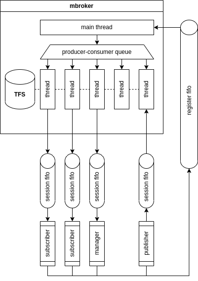

# 2º Exercício | _Message Broker_

O segundo exercício do projeto pretende construir um sistema simples de publicação e subscrição de mensagens, que são armazenadas no sistema de ficheiros TecnicoFS.
O sistema vai ter um processo servidor autónomo, ao qual diferentes processos clientes se podem ligar, para publicar ou receber mensagens numa dada caixa de armazenamento de mensagens.

## Ponto de partida

Para resolver o segundo exercício, os grupos devem usar como base a sua solução do 1º exercício ou [aceder ao novo código base](https://github.com/tecnico-so/projeto-so-2022-23/), que estende a versão original do TecnicoFS das seguintes maneiras:

- As operações principais do TecnicoFS estão sincronizadas usando um único trinco (_mutex_) global.
Embora menos paralela que a solução pretendida para o primeiro exercício, esta solução de sincronização é suficiente para implementar os novos requisitos;
- É implementado a operação `tfs_unlink`, que permite remover ficheiros.

Adicionalmente, o código base inclui esqueletos para:

1. O programa do servidor _mbroker_ (na diretoria `mbroker`);
2. A implementação do cliente para publicação (na diretoria `publisher`);
3. A implementação do cliente para subscrição (na diretoria `subscriber`);
4. A implementação do cliente de gestão (directoria `manager`).

Em vez do novo código base, os grupos que tenham uma solução robusta no 1º exercício são encorajados a construírem a solução com base na sua versão, que à partida estará mais otimizada em termos de concorrência.

## 1. Arquitetura do sistema

O sistema é formado pelo servidor (_mbroker_) e por vários publicadores (_publishers_), subscritores (_subscribers_) e gestores (_manager_).

### Caixas de Mensagens

Um conceito fundamental do sistema são as caixas de mensagens.
Cada caixa pode ter um publicador e múltiplos subscritores.
O _publisher_ coloca mensagens na caixa, e os vários _subscribers_ lêem as mensagens da caixa.
Cada caixa é suportada no servidor por um ficheiro no TFS.
Por esta razão, o ciclo de vida de uma caixa é distinto do ciclo de vida do _publisher_ que lá publica mensagens. 
Aliás, é possível que uma caixa venha a ter vários _publishers_ ao longo da sua existência, embora apenas um de cada vez.

As operações de criação e remoção de caixa são geridas pelo _manager_.
Adicionalmente, o _manager_ permite listar as caixas existentes na _mbroker_.

### 1.1. Servidor

O servidor incorpora o TecnicoFS e é um processo autónomo, inicializado da seguinte forma:

```sh
$ mbroker <pipename> <max_sessions>
```

O servidor cria um _named pipe_ cujo nome (_pipename_) é o indicado no argumento acima.
É através deste _named pipe_, criado pelo servidor, que os processos cliente se poderão ligar para se registarem.

Qualquer processo cliente pode ligar-se ao _named pipe_ do servidor e enviar-lhe uma mensagem a solicitar o início de uma sessão.
Uma **sessão** consiste em ter um _named pipe_ do cliente, onde o cliente envia as mensagens (se for um publicador) ou onde o cliente recebe mensagens (se for um subscritor).
Um dado cliente apenas assume um dos dois papéis, ou seja, ou é exclusivamente publicador e só envia informação para o servidor, ou é exclusivamente subscritor (ou gestor) e só recebe informação.

O _named pipe_ da sessão deve ser criado previamente pelo cliente.
Na mensagem de registo, o cliente envia o nome do _named pipe_ a usar durante a sessão.

Uma sessão mantém-se aberta até que aconteça uma das seguintes situações:

1. Um cliente (publicador ou subscritor) feche o seu _named pipe_, sinalizando implicitamente o fim de sessão;
2. A caixa é removida pelo gestor.

O servidor aceita um número máximo de sessões em simultâneo, definido pelo valor do argumento `max_sessions`.

Nas subsecções seguintes descrevemos o protocolo cliente-servidor em maior detalhe, i.e., o conteúdo das mensagens de pedido e resposta trocadas entre clientes e servidor.

#### 1.1.1. Arquitectura do servidor

O servidor deve ter uma _thread_ para gerir o _named pipe_ de registo e lançar `max_sessions` threads para processar sessões.
Quando chega um novo pedido de registo, este deve ser enviado para uma _thread_ que se encontre disponível, que irá processá-lo durante o tempo necessário. 
Para gerir estes pedidos, evitando que as _threads_ fiquem em espera ativa, a _main thread_ e as _worker threads_ cooperam utilizando uma **fila produtor-consumidor**, segundo a interface disponibilizada no ficheiro `producer-consumer.h`.
Desta forma, quando chega um novo pedido de registo, este é colocado na fila e assim que uma _thread_ fique disponível, irá consumir e tratar esse pedido.

A arquitetura do servidor está sumarizada na seguinte figura:



- O _mbroker_ usa o TFS para armazenar as mensagens das caixas;
- A _main thread_ recebe pedidos através do _register pipe_ e coloca-os numa fila de produtor-consumidor;
- As _worker threads_ executam os pedidos dos clientes, dedicando-se a atender um cliente de cada vez;
- Cooperam com a _main thread_ através de uma fila produtor-consumidor, que evita espera ativa.

### 1.2. _Publisher_

Um publicador é um processo lançado da seguinte forma:

```sh
pub <register_pipe> <pipe_name> <box_name>
```

Assim que é lançado, o _publisher_, pede para iniciar uma sessão no servidor de _mbroker_, indicando a caixa de mensagens para a qual pretende escrever mensagens.
Se a ligação for aceite (pode ser rejeitada caso já haja um _publisher_ ligado à caixa, por exemplo) fica a receber mensagens do `stdin` e depois publica-as. 
Uma **mensagem** corresponde a uma linha do `stdin`, sendo truncada a um dado valor máximo e delimitada por um `\0`, como uma _string_ de C.
A mensagem não deve incluir um `\n` final.

Se o _publisher_ receber um EOF (_End Of File_, por exemplo, com um Ctrl-D), deve encerrar a sessão fechando o _named pipe_.

O nome do _named pipe_ da sessão é escolhido automaticamente pelo _publisher_, de forma a garantir que não existem conflitos com outros clientes concorrentes.
O _named pipe_ deve ser removido do sistema de ficheiros após o fim da sessão.

### 1.3. _Subscriber_

Um subscritor é um processo lançado da seguinte forma:

```sh
sub <register_pipe> <pipe_name> <box_name>
```

Assim que é lançado, o _subscriber_:

1. Liga-se à _mbroker_, indicando qual a caixa de mensagens que pretende subscrever;
2. Recolhe as mensagens já aí armazenadas e imprime-as uma a uma no `stdout`, delimitadas por `\n`;
3. Fica à escuta de novas mensagens;
4. Imprime novas mensagens quando são escritas para o _named pipe_ para o qual tem uma sessão aberta.

Para terminar o _subscriber_, este deve processar adequadamente o `SIGINT` (i.e., o Ctrl-C), fechando a sessão e imprimindo no `stdout` o número de mensagens recebidas durante a sessão.

O nome do _named pipe_ da sessão é escolhido automaticamente pelo _subscriber_, de forma a garantir que não existem conflitos com outros clientes concorrentes.
O _named pipe_ deve ser removido do sistema de ficheiros após o fim da sessão.

### 1.4. _Manager_

Um gestor é um processo lançado de uma das seguintes formas:

```sh
manager <register_pipe> <pipe_name> create <box_name>
manager <register_pipe> <pipe_name> remove <box_name>
manager <register_pipe> <pipe_name> list
```

Assim que é lançado, o _manager_:

 1. Envia o pedido à _mbroker_;
 2. Recebe a resposta no _named pipe_ criado pelo próprio _manager_;
 3. Imprime a resposta e termina.

O nome do _named pipe_ da sessão é escolhido automaticamente pelo _manager_, de forma a garantir que não existem conflitos com outros clientes concorrentes.
O _named pipe_ deve ser removido do sistema de ficheiros antes do _manager_ terminar.

### 1.5. Exemplos de execução

Um primeiro **exemplo** considera o funcionamento **sequencial** dos clientes:

 1. Um _manager_ cria a caixa `bla`;
 2. Um _publisher_ liga-se à mesma caixa, escreve 3 mensagens e desliga-se;
 3. Um _subscriber_ liga-se à mesma caixa e começa a receber mensagens;
 4. Recebe as três, uma de cada vez, e depois fica à espera de mais mensagens.

Num segundo **exemplo**, mais interessante, vai existir **concorrência** entre clientes:

 1. Um _publisher_ liga-se;
 2. Entretanto, um _subscriber_ para a mesma caixa, liga-se também;
 3. O _publisher_ coloca mensagens na caixa e estas vão sendo entregues imediatamente ao _subscriber_, ficando à mesma registadas no ficheiro;
 4. Um outro _subscriber_ liga-se à mesma caixa, e começa a receber as mensagens todas desde o início da sua subscrição;
 5. Agora, quando o _publisher_ escreve uma nova mensagem, ambos os _subscriber_ recebem a mensagem diretamente.

## 2. Protocolo

Para moderar a interação entre o servidor e os clientes, é estabelecido um protocolo, que define como é que as mensagens são serializadas, ou seja, como é que ficam arrumadas num _buffer_ de _bytes_.
Este tipo de protocolo é por vezes referido como um _wire protocol_, numa alusão aos dados que efetivamente circulam no meio de transmissão, que neste caso, serão os _named pipes_.

O conteúdo de cada mensagem deve seguir o seguinte formato, onde:

- O símbolo `|` denota a concatenação de elementos numa mensagem;
- Todas as mensagens de pedido são iniciadas por um código que identifica a operação solicitada (`OP_CODE`);
- As _strings_ que transportam os nomes de _named pipes_ são de tamanho fixo, indicado na mensagem.
No caso de nomes de tamanho inferior, os caracteres adicionais devem ser preenchidos com `\0`.

### 2.1. Registo

O _named pipe_ do servidor, que só recebe registos de novos clientes, deve receber mensagens do seguinte tipo:

Pedido de registo de _publisher_:

```
[ code = 1 (uint8_t) ] | [ client_named_pipe_path (char[256]) ] | [ box_name (char[32]) ]
```

Pedido de registo de _subscriber_:

```
[ code = 2 (uint8_t) ] | [ client_named_pipe_path (char[256]) ] | [ box_name (char[32]) ]
```

Pedido de criação de caixa:

```
[ code = 3 (uint8_t) ] | [ client_named_pipe_path (char[256]) ] | [ box_name (char[32]) ]
```

Resposta ao pedido de criação de caixa:

```
[ code = 4 (uint8_t) ] | [ return_code (int32_t) ] | [ error message (char[1024]) ]
```

O return code deve ser `0` se a caixa foi criada com sucesso, e `-1` em caso de erro.
Em caso de erro a mensagem de erro é enviada (caso contrário, fica simplesmente inicializada com `\0`).

Pedido de remoção de caixa:

```
[ code = 5 (uint8_t) ] | [ client_named_pipe_path (char[256]) ] | [ box_name (char[32]) ]
```

Resposta ao pedido de remoção de caixa:

```
[ code = 6 (uint8_t) ] | [ return_code (int32_t) ] | [ error message (char[1024]) ]
```

Pedido de listagem de caixas:

```
[ code = 7 (uint8_t) ] | [ client_named_pipe_path (char[256]) ]
```

A resposta à listagem de caixas vem em várias mensagens, do seguinte tipo:

```
[ code = 8 (uint8_t) ] | [ last (uint8_t) ] | [ box_name (char[32]) ] | [ box_size (uint64_t) ] | [ n_publishers (uint64_t) ] | [ n_subscribers (uint64_t) ]
```

O byte `last` é `1` se esta for a última caixa da listagem e a `0` em caso contrário.
`box_size` é o tamanho (em _bytes_) da caixa, com `n_publisher` (`0` ou `1`) indicando se existe um _publisher_ ligado à caixa naquele momento, e `n_subscriber` o número de subscritores da caixa naquele momento.

### 2.2 _Publisher_

O _publisher_ envia mensagens para o servidor do tipo:

```
[ code = 9 (uint8_t) ] | [ message (char[1024]) ]
```

### 2.3 _Subscriber_

O servidor envia mensagens para o _subscriber_ do tipo:

```
[ code = 10 (uint8_t) ] | [ message (char[1024]) ]
```

## 3. Requisitos de implementação

### 3.1. Tratamento de clientes

Quando o servidor inicia, lança um conjunto de `S` tarefas (_thread pool_), que ficam à espera de pedidos de registo para tratar, que irão receber através da fila produtor-consumidor.
A _main thread_ gere o _named pipe_ de registo, e coloca os pedidos de registo na fila produtor-consumidor.
Quando uma _thread_ termina uma sessão, fica à espera de nova sessão para tratar.

### 3.2 Caixas de armazenamento

As mensagens recebidas pelo servidor devem ser colocadas numa caixa.
Na prática, uma caixa corresponde a um ficheiro no TecnicoFS.
O ficheiro deve ser criado quando a caixa for criada pelo _manager_, e apagado quando a caixa for removida.
Todas as mensagens que vão sendo recebidas são escritas no fim do ficheiro, separadas por `\0`.

Resumindo, as mensagens são acumuladas nas caixas.
Quando um subscritor se liga a uma caixa, o ficheiro correspondente é aberto e as mensagens começam a ser lidas desde o início (mesmo que o mesmo subscritor ou outro já as tenha recebido antes).
Ulteriores mensagens geradas pelo _publisher_ de uma caixa deverão ser também entregues aos _subscribers_ da caixa.
Esta funcionalidade deverá ser implementada usando **variáveis de condição** com o objetivo de evitar esperas ativas. 

### 3.3 Formatação de mensagens

Para uniformizar o _output_ dos diversos comandos (para o `stdout`), é fornecido o formato com que estas devem ser impressas.

### 3.4 Fila Produtor-Consumidor

A fila produtor-consumidor é a estrutura de sincronização mais complexa do projeto.
Por isso, esta componente vai ser avaliada em isolamento (i.e., existirão testes que usam apenas a interface descrita no `producer-consumer.h`) para garantir a sua correção.
Como tal, a interface do `producer-consumer.h` não deve ser alterada.

De resto, os grupos são livres de alterar o código base como lhes for conveniente.

#### Mensagens do subscritor

```c
fprintf(stdout, "%s\n", message);
```

#### Listagem de caixas

Cada linha da listagem de caixas deve ser impressa da seguinte forma:

```c
fprintf(stdout, "%s %zu %zu %zu\n", box_name, box_size, n_publishers, n_subscribers);
```

As caixas devem estar ordenadas por ordem alfabética, não sendo garantido que o servidor as envie por essa ordem (i.e., o cliente deve ordenar as caixas antes das imprimir).

### 3.5 Espera Ativa

No projeto, nunca devem ser usados mecanismos de espera ativa.

## 4. Sugestão de implementação

Sugere-se que implementem o projeto através dos seguintes passos:

1. Implementar as interfaces de linha de comando (CLI) dos clientes;
2. Implementar a serialização do protocolo de comunicação;
3. Implementar uma versão básica do `mbroker`, onde só existe uma _thread_ que, em ciclo, a) recebe um pedido de registo; b) trata a sessão correspondente; e c) volta a ficar à espera do pedido de registo;
4. Implementar a fila produtor-consumidor;
5. Utilizar a fila produtor-consumidor para gerir e encaminhar os pedidos de registo para as _worker threads_.

## 5. Submissão e avaliação

A submissão é feita através do Fénix **até sexta-feira, dia 13/Janeiro/2023, às 20h00**.

Os estudantes devem submeter um ficheiro no formato `zip` com o código fonte e o ficheiro `Makefile`.
O arquivo submetido não deve incluir outros ficheiros (tais como binários).
Além disso, o comando `make clean` deve limpar todos os ficheiros resultantes da compilação do projeto, bem como o comando `make fmt`, para formatar automaticamente o código.

Recomendamos que os alunos se assegurem que o projeto compila/corre corretamente no [ambiente de referência](https://github.com/tecnico-so/lab_ambiente).
Ao avaliar os projetos submetidos, em caso de dúvida sobre o funcionamento do código submetido, os docentes usarão o ambiente de referência para fazer a validação final.
O uso de outros ambientes para o desenvolvimento/teste do projeto (e.g., macOS, Windows/WSL) é permitido, mas o corpo docente não dará apoio técnico a dúvidas relacionadas especificamente com esses ambientes.

A avaliação será feita de acordo com o método de avaliação descrito no Fénix

_Bom trabalho!_
